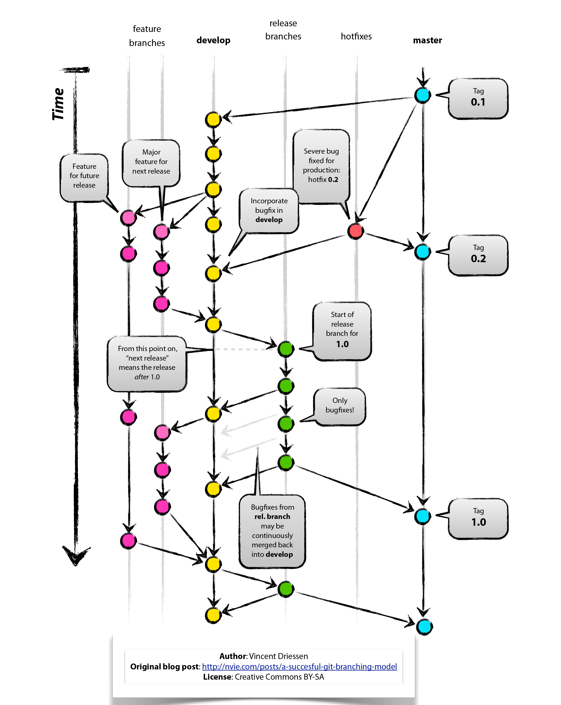

Source Code Repository
======================

.. _blessed-repository:

xobox uses `Git`_ for managing source code repositories. The project's "blessed" Git repository (``origin``) resides at
`GitHub`_. It is publicly accessible, but only :ref:`developers <developers>` and :ref:`core team members <core-team>`
can push into this blessed repository.

Repository Structure
--------------------

.. _protected-branches:

Protected Branches
~~~~~~~~~~~~~~~~~~

By principle, all eternal branches are managed as `protected branches`_:

* ``master`` is the main (eternal) branch. Any code in ``master`` is considered production ready.
* ``develop`` always reflects a state with the latest delivered development changes for the next release.
  This is where any automatic nightly builds are built from.

.. _feature-branches:

Feature Branches
~~~~~~~~~~~~~~~~

Feature branches are used to develop new features for the upcoming or a distant future release. When starting
development of a feature, the target release in which this feature will be incorporated may well be unknown at that
point. The essence of a feature branch is that it exists as long as the feature is in development, but will eventually
be merged back into ``develop``.

* Feature branches must be branched off ``develop``
* Feature branches must relate to a GitHub issue
* By convention, their name shall be prefixed with ``feature/`` and the issue ID they refer to
* Feature branches merge back into ``develop`` via :ref:`pull request <pull-request>`
* Feature branches are deleted after being merged back into ``develop``. They typically exist in developer repos only,
  but not in ``origin``.

.. _release-branches:

Release Branches
~~~~~~~~~~~~~~~~

Release branches support preparation of a new production release. They allow for last-minute minor bug fixes and
preparing meta-data for a release (version number, build dates, etc.). By doing all of this work on a release branch,
the develop branch is cleared to receive features for the next big release.

* Release branches must be branched off ``develop``
* By convention, their name shall be prefixed with ``release/``, followed by the release's version number.
* Release branches merge back into ``master`` **and** ``develop`` via :ref:`pull request <pull-request>`. A merge of
  a release branch back into ``master`` absolutely requires a release tag to be set on master for that commit.

.. _hotfix-branches:

Hotfix Branches
~~~~~~~~~~~~~~~

Hotfix branches are very much like release branches in that they are also meant to prepare for a new production release,
albeit unplanned. They arise from the necessity to act immediately upon an undesired state of a live production version.
When a critical bug in a production version must be resolved immediately, a hotfix branch may be branched off from the
corresponding tag on the master branch that marks the production version.

* Hotfix branches must be branched off the corresponding release tag on ``master``
* By convention, their name shall be prefixed with ``release/``, followed by the release's version number and hotfix
  suffix, as well as a reference to the corresponding :ref:`issue <issues>`.
* Hotfix branches merge back into ``master`` **and** ``develop`` via :ref:`pull request <pull-request>`. A merge of
  a hotfix branch back into ``master`` absolutely requires a release tag to be set on master for that commit.

.. _git-workflow:

Git Workflow
------------

For the xobox project, we chose to follow the `Git Flow`_ for development. The following graph illustrates the flow:

The development of a new feature, or the improvement of an existing feature (including bug fixing) always starts with
opening an :doc:`issue <issues>`. Once the issue is created and assigned, a feature branch has to be created, following
this naming convention::

   feature/<issue ID>-<class>-description

.. note::

   Please note that the branch name must comply with reference name rules (cf. `git check-ref-format`_).

The **Issue ID** is the numerical identifier generated by GitHub, padded to six digits (left padding with ``0``).

The **class** may be one of

* *new* -- for new features
* *imp* -- for optimisation or enhancement
* *doc* -- for documentation only updates

.. code-block:: bash

   git fetch
   git checkout develop
   git pull
   git checkout -b feature/001234-new-supergadget develop

As soon as the feature branch is created and work has started, the related :ref:`issue status <issue-status>` should be
updated to "in progress".

.. important::

   Do not use issue closing hooks (e. g. ``Fixes #1234``) in your commit messages when committing to the feature branch.
   Closing the issue is reserved for the pull request.

Once the work on the feature branch is done and continuous integration testing shows positive results, a
:ref:`pull request <pull-request>` can be opened to notify the :ref:`core team <core-team>`. The
:ref:`status <issue-status>` of the corresponding issue should be updated to "ready".

In case of acceptance, the pull request is authorised by a core team member, the feature branch gets merged into
``develop`` and is then deleted. The :ref:`issue status <issue-status>` is updated to "Staging", which means the
issue can now be tested in the nightly builds.

.. _pull-request:

Pull Request
------------

`GitHub Pull Requests`_ are used to merge new code from a :ref:`feature branch <feature-branches>` into a
:ref:`protected branch <protected-branches>` or from one protected branch into another.

This section concentrates on pull requests opened by :ref:`developers <developers>` in order to have a feature
branch merged into ``develop``. Any other case, where pull requests are used (e. g. cleansing of branches etc.)
are processes solely played within the :ref:`core team <core-team>`.

.. hint::

   You can use a pull request for intermediate reviews with the core team. In that case, keep the
   :ref:`status <issue-status>` of the corresponding issue set to "in progress", prefix the merge
   request title with ``[WIP]`` and do **not** assign the pull request to anyone.

Pull requests may be accepted straight away (mostly in very simple cases, e. g. a simple bug fix) -- although this most
likely will rather be an exception. In such a case, the :ref:`status <issue-status>` of the corresponding issue will be
updated to "staging" by the core team member who accepted the pull request.

If otherwise the :ref:`core team <core-team>` accepts the pull request for review, they will update the
:ref:`issue status <issue-status>` to "Review" and assign a core team member to the pull request. In this
(much more likely) scenario, the core team member in charge will review the content of the change request and its
implications for the code in ``develop`` together with the :ref:`developer <developers>` who opened the pull request.

.. note::

   Do not abuse pull requests to mature your code. As a general rule, a pull request should only be opened
   if implementation work on the feature branch is completed, and CI testing gives a green status.

In case of obvious immaturity or non-quality, non-compliance with governance and :doc:`coding style <code-style>`, a
pull request may be rejected by the core team. In such a case, the core team member rejecting the pull request shall
write a justification statement (as a comment on the pull request), explaining why this pull request has been
rejected.

.. _Git: http://git-scm.com/
.. _GitHub: https://github.com/stormrose-va/xobox
.. _Git Flow: http://nvie.com/posts/a-successful-git-branching-model/
.. _protected branches: https://help.github.com/articles/about-protected-branches/
.. _git check-ref-format: https://www.kernel.org/pub/software/scm/git/docs/git-check-ref-format.html
.. _GitHub Pull Requests: https://help.github.com/articles/about-pull-requests/
.. _Heroku Review App: https://devcenter.heroku.com/articles/github-integration-review-apps
